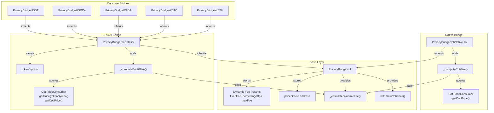
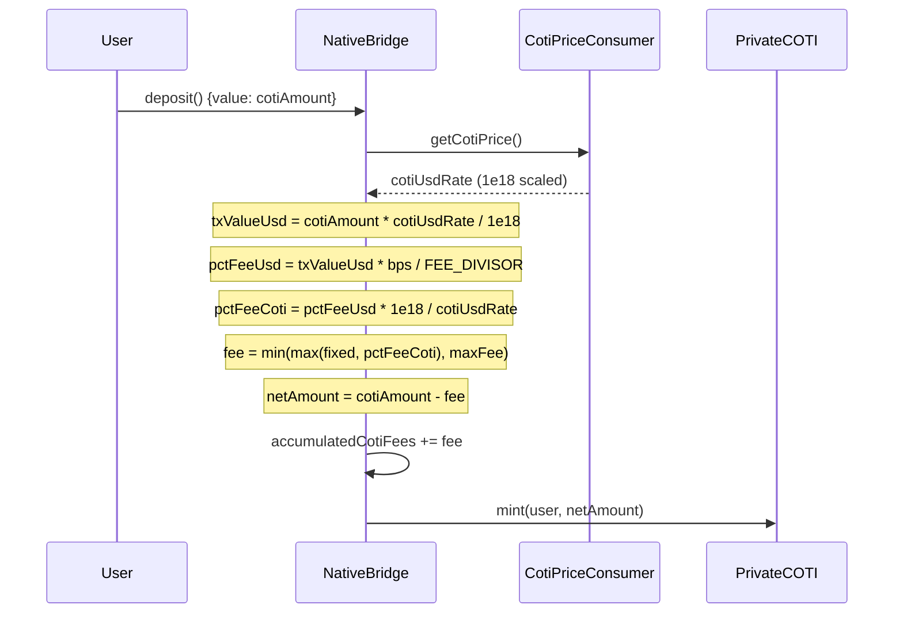
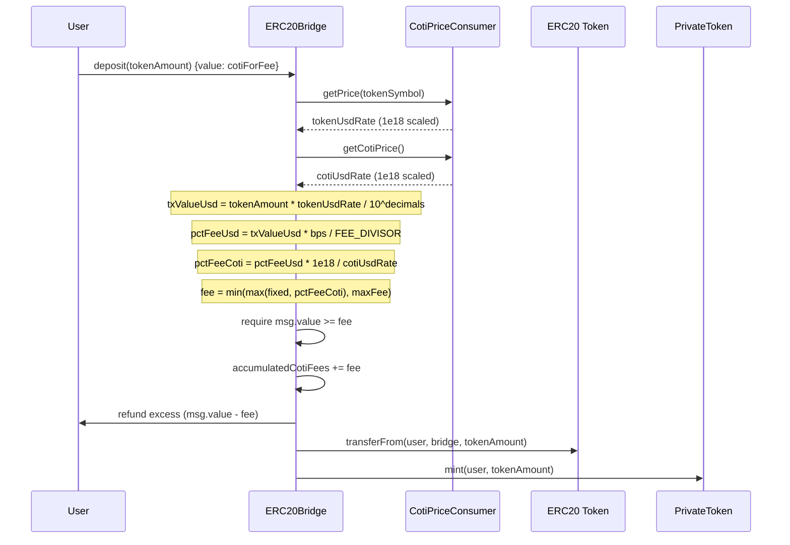

# Design Document: Dynamic Fees

## Overview

This design replaces the current percentage-based bridged-asset fee model with a dynamic fee formula charged exclusively in native COTI. The fee is computed based on the USD value of the transaction, converted to COTI using the `CotiPriceConsumer` Band Protocol oracle. The formula is:

```
Fee (in COTI) = min( max( FIXED, percentageOfUsdValue_in_COTI ), MAX_FEE )
```

The change affects three contract layers:
- `PrivacyBridge.sol` (base) — new state variables, `_calculateDynamicFee`, setters, events
- `PrivacyBridgeCotiNative.sol` — `_computeCotiFee` helper, updated deposit/withdraw/onTokenReceived
- `PrivacyBridgeERC20.sol` — `tokenSymbol` state, `_computeErc20Fee` helper with decimal normalization, fee collected from `msg.value` instead of token deduction

All fees accumulate in `accumulatedCotiFees` (native COTI). The legacy bridged-asset fee path (`_collectTokenFee`, `accumulatedFees`, `depositFeeBasisPoints`, `withdrawFeeBasisPoints`) is deprecated.

## Architecture



### Fee Flow — Native Bridge (deposit)



### Fee Flow — ERC20 Bridge (deposit)



## Components and Interfaces

### PrivacyBridge.sol (Base Contract) — Modifications

**New State Variables:**
```solidity
uint256 public depositFixedFee = 10 ether;       // 10 COTI floor
uint256 public depositPercentageBps = 500;        // 0.05% (500 / 1,000,000)
uint256 public depositMaxFee = 3000 ether;        // 3,000 COTI cap

uint256 public withdrawFixedFee = 3 ether;        // 3 COTI floor
uint256 public withdrawPercentageBps = 250;       // 0.025% (250 / 1,000,000)
uint256 public withdrawMaxFee = 1500 ether;       // 1,500 COTI cap

address public priceOracle;                       // CotiPriceConsumer address
```

**New Internal Function:**
```solidity
function _calculateDynamicFee(
    uint256 percentageFeeCoti,
    uint256 fixedFee,
    uint256 maxFee
) internal pure returns (uint256) {
    uint256 fee = percentageFeeCoti > fixedFee ? percentageFeeCoti : fixedFee;
    return fee > maxFee ? maxFee : fee;
}
```

**New Setter Functions:**
```solidity
function setDepositDynamicFee(uint256 _fixedFee, uint256 _percentageBps, uint256 _maxFee) external onlyOperator;
function setWithdrawDynamicFee(uint256 _fixedFee, uint256 _percentageBps, uint256 _maxFee) external onlyOperator;
function setPriceOracle(address _oracle) external onlyOwner;
```

**New Events:**
```solidity
event DynamicFeeUpdated(string feeType, uint256 fixedFee, uint256 percentageBps, uint256 maxFee);
event PriceOracleUpdated(address indexed oldOracle, address indexed newOracle);
```

**New Errors:**
```solidity
error InvalidFeeConfiguration();  // fixedFee > maxFee or maxFee == 0
```

**Deprecated (no longer used by deposit/withdraw flows):**
- `depositFeeBasisPoints`, `withdrawFeeBasisPoints`
- `_calculateFeeAmount()`, `_collectTokenFee()`
- `setDepositFee()`, `setWithdrawFee()`
- `accumulatedFees` (bridged-asset fees)

### PrivacyBridgeCotiNative.sol — Modifications

**New Internal Helper:**
```solidity
function _computeCotiFee(
    uint256 cotiAmount,
    uint256 fixedFee,
    uint256 percentageBps,
    uint256 maxFee
) internal view returns (uint256) {
    uint256 cotiUsdRate = CotiPriceConsumer(priceOracle).getCotiPrice();
    uint256 txValueUsd = (cotiAmount * cotiUsdRate) / 1e18;
    uint256 percentageFeeUsd = (txValueUsd * percentageBps) / FEE_DIVISOR;
    uint256 percentageFeeCoti = (percentageFeeUsd * 1e18) / cotiUsdRate;
    return _calculateDynamicFee(percentageFeeCoti, fixedFee, maxFee);
}
```

**Modified Functions:**
- `_deposit(address sender)` — replace `_collectTokenFee` with `_computeCotiFee`, deduct fee from `msg.value`, accumulate to `accumulatedCotiFees`
- `_withdraw(address to, uint256 amount)` — replace `_collectTokenFee` with `_computeCotiFee`, deduct fee from amount, accumulate to `accumulatedCotiFees`
- `onTokenReceived(...)` — same replacement as `_withdraw`
- `withdrawFees(...)` — withdraw from `accumulatedCotiFees` instead of `accumulatedFees`

### PrivacyBridgeERC20.sol — Modifications

**New State Variable:**
```solidity
string public tokenSymbol;  // Band oracle symbol (e.g., "ETH", "WBTC", "ADA", "USDC", "USDT")
```

**Constructor Change:**
```solidity
constructor(address _token, address _privateToken, string memory _tokenSymbol) PrivacyBridge() {
    // ... existing validation ...
    tokenSymbol = _tokenSymbol;
}
```

**New Internal Helper:**
```solidity
function _computeErc20Fee(
    uint256 tokenAmount,
    uint256 fixedFee,
    uint256 percentageBps,
    uint256 maxFee
) internal view returns (uint256) {
    CotiPriceConsumer oracle = CotiPriceConsumer(priceOracle);
    uint256 tokenUsdRate = oracle.getPrice(tokenSymbol);
    uint256 cotiUsdRate = oracle.getCotiPrice();
    uint8 tokenDecimals = IHasDecimals(address(token)).decimals();
    uint256 txValueUsd = (tokenAmount * tokenUsdRate) / (10 ** tokenDecimals);
    uint256 percentageFeeUsd = (txValueUsd * percentageBps) / FEE_DIVISOR;
    uint256 percentageFeeCoti = (percentageFeeUsd * 1e18) / cotiUsdRate;
    return _calculateDynamicFee(percentageFeeCoti, fixedFee, maxFee);
}
```

**New Internal Helper (replaces `_collectNativeFee`):**
```solidity
function _collectDynamicNativeFee(uint256 fee) internal {
    if (msg.value < fee) revert InsufficientCotiFee();
    accumulatedCotiFees += fee;
    if (msg.value > fee) {
        uint256 excess = msg.value - fee;
        (bool ok, ) = msg.sender.call{value: excess}("");
        if (!ok) {
            accumulatedCotiFees += excess;
        }
    }
}
```

**Modified `_deposit`:**
- Compute fee via `_computeErc20Fee(amount, depositFixedFee, depositPercentageBps, depositMaxFee)`
- Collect fee from `msg.value` via `_collectDynamicNativeFee(fee)`
- Transfer full `amount` of ERC20 tokens (no deduction)
- Mint full `amount` of private tokens

**Modified `_withdraw`:**
- Compute fee via `_computeErc20Fee(amount, withdrawFixedFee, withdrawPercentageBps, withdrawMaxFee)`
- Collect fee from `msg.value` via `_collectDynamicNativeFee(fee)`
- Burn full `amount` of private tokens
- Release full `amount` of ERC20 tokens

**Removed:**
- `_collectNativeFee()` — replaced by `_collectDynamicNativeFee`
- `_collectTokenFee()` calls — no token-denominated fees
- `withdrawFees()` for bridged-asset fees — all fees via `withdrawCotiFees()`

### Concrete Bridge Constructor Changes

Each concrete bridge passes the Band oracle symbol to the updated `PrivacyBridgeERC20` constructor:

| Contract | Constructor Call |
|----------|----------------|
| `PrivacyBridgeWETH` | `PrivacyBridgeERC20(_weth, _privateWeth, "ETH")` |
| `PrivacyBridgeWBTC` | `PrivacyBridgeERC20(_wbtc, _privateWbtc, "WBTC")` |
| `PrivacyBridgeWADA` | `PrivacyBridgeERC20(_wada, _privateWada, "ADA")` |
| `PrivacyBridgeUSDCe` | `PrivacyBridgeERC20(_usdc, _privateUsdc, "USDC")` |
| `PrivacyBridgeUSDT` | `PrivacyBridgeERC20(_usdt, _privateUsdt, "USDT")` |

### CotiPriceConsumer.sol — No Changes

The oracle contract is already deployed and provides the required API:
- `getCotiPrice()` → COTI/USD rate (1e18 scaled)
- `getPrice(string)` → TOKEN/USD rate (1e18 scaled)
- Built-in staleness checks that revert on stale data

## Data Models

### New State Variables (PrivacyBridge.sol)

| Variable | Type | Default | Description |
|----------|------|---------|-------------|
| `depositFixedFee` | `uint256` | `10 ether` | Deposit fee floor in COTI wei |
| `depositPercentageBps` | `uint256` | `500` | Deposit percentage (500/1M = 0.05%) |
| `depositMaxFee` | `uint256` | `3000 ether` | Deposit fee cap in COTI wei |
| `withdrawFixedFee` | `uint256` | `3 ether` | Withdraw fee floor in COTI wei |
| `withdrawPercentageBps` | `uint256` | `250` | Withdraw percentage (250/1M = 0.025%) |
| `withdrawMaxFee` | `uint256` | `1500 ether` | Withdraw fee cap in COTI wei |
| `priceOracle` | `address` | `address(0)` | CotiPriceConsumer contract address |

### New State Variable (PrivacyBridgeERC20.sol)

| Variable | Type | Default | Description |
|----------|------|---------|-------------|
| `tokenSymbol` | `string` | Set in constructor | Band oracle symbol for the bridged token |

### Fee Accumulation Path Change

| Before | After |
|--------|-------|
| Native bridge: fees in `accumulatedFees` (native COTI) | Native bridge: fees in `accumulatedCotiFees` (native COTI) |
| ERC20 bridge: token fees in `accumulatedFees` + flat COTI in `accumulatedCotiFees` | ERC20 bridge: all fees in `accumulatedCotiFees` (native COTI only) |

### Events

| Event | Parameters | Emitted By |
|-------|-----------|------------|
| `DynamicFeeUpdated` | `string feeType, uint256 fixedFee, uint256 percentageBps, uint256 maxFee` | `setDepositDynamicFee`, `setWithdrawDynamicFee` |
| `PriceOracleUpdated` | `address indexed oldOracle, address indexed newOracle` | `setPriceOracle` |


## Correctness Properties

*A property is a characteristic or behavior that should hold true across all valid executions of a system — essentially, a formal statement about what the system should do. Properties serve as the bridge between human-readable specifications and machine-verifiable correctness guarantees.*

### Property 1: Dynamic fee formula correctness

*For any* triple `(percentageFeeCoti, fixedFee, maxFee)` where `fixedFee <= maxFee` and `maxFee > 0`, `_calculateDynamicFee(percentageFeeCoti, fixedFee, maxFee)` SHALL return a value equal to `min(max(fixedFee, percentageFeeCoti), maxFee)`, and the result SHALL always satisfy `fixedFee <= result <= maxFee`.

**Validates: Requirements 2.1, 12.1, 12.2, 12.3**

### Property 2: Native bridge deposit fee and net amount

*For any* native COTI deposit amount and any positive COTI/USD oracle rate, the native bridge deposit SHALL compute a fee matching the dynamic fee formula applied to the COTI amount's USD value, and the minted private token amount SHALL equal `msg.value - fee`, and `accumulatedCotiFees` SHALL increase by exactly `fee`.

**Validates: Requirements 2.2, 3.1**

### Property 3: Native bridge withdrawal fee and net amount

*For any* native COTI withdrawal amount and any positive COTI/USD oracle rate (via either `_withdraw` or `onTokenReceived`), the native bridge withdrawal SHALL compute a fee matching the dynamic fee formula applied to the withdrawal amount's USD value, and the native COTI sent to the user SHALL equal `amount - fee`, and `accumulatedCotiFees` SHALL increase by exactly `fee`.

**Validates: Requirements 2.2, 3.2, 3.3**

### Property 4: ERC20 bridge fee computation with decimal normalization

*For any* ERC20 token amount, any positive TOKEN/USD rate, any positive COTI/USD rate, and any token decimal precision in {6, 8, 18}, the ERC20 bridge fee computation SHALL produce a fee in COTI matching: `_calculateDynamicFee(percentageFeeCoti, fixedFee, maxFee)` where `percentageFeeCoti` is derived from `txValueUsd = tokenAmount * tokenUsdRate / 10^tokenDecimals`.

**Validates: Requirements 2.3, 2.4, 11.1**

### Property 5: ERC20 bridge full token passthrough

*For any* ERC20 bridge deposit or withdrawal with sufficient `msg.value`, the full token amount SHALL pass through without deduction — the user receives/sends the exact token amount, and the fee is collected exclusively from `msg.value` in native COTI.

**Validates: Requirements 4.1, 4.2, 9.3**

### Property 6: ERC20 bridge excess msg.value refund

*For any* ERC20 bridge operation where `msg.value` exceeds the computed dynamic fee, the excess `(msg.value - fee)` SHALL be refunded to the sender (or added to `accumulatedCotiFees` if refund fails).

**Validates: Requirements 4.3**

### Property 7: Fee setter validation

*For any* triple `(fixedFee, percentageBps, maxFee)`, calling `setDepositDynamicFee` or `setWithdrawDynamicFee` SHALL succeed if and only if `fixedFee <= maxFee` AND `percentageBps <= MAX_FEE_UNITS` AND `maxFee > 0`. Invalid inputs SHALL revert.

**Validates: Requirements 6.3, 6.4**

## Error Handling

| Condition | Error | Contract |
|-----------|-------|----------|
| Oracle returns stale data | `StaleOracleData` (propagated from CotiPriceConsumer) | All bridges |
| COTI/USD rate is zero | Division by zero revert in fee conversion | All bridges |
| Net amount after fee is zero (native bridge) | `AmountZero` | PrivacyBridgeCotiNative |
| `msg.value < computed fee` (ERC20 bridge) | `InsufficientCotiFee` | PrivacyBridgeERC20 |
| `fixedFee > maxFee` in setter | `InvalidFeeConfiguration` | PrivacyBridge |
| `percentageBps > MAX_FEE_UNITS` in setter | `InvalidFee` | PrivacyBridge |
| `maxFee == 0` in setter | `InvalidFeeConfiguration` | PrivacyBridge |
| `setPriceOracle(address(0))` | `InvalidAddress` | PrivacyBridge |
| Non-operator calls fee setter | AccessControl revert | PrivacyBridge |
| Non-owner calls `setPriceOracle` | `OwnableUnauthorizedAccount` | PrivacyBridge |
| Excess refund fails (ERC20 bridge) | Excess added to `accumulatedCotiFees` (no revert) | PrivacyBridgeERC20 |

## Testing Strategy

### Property-Based Tests (Hardhat + fast-check)

Property-based testing is appropriate for this feature because the fee computation is a pure arithmetic pipeline with a large input space (uint256 amounts, oracle rates, decimal configurations). Universal properties hold across all valid inputs, and 100+ iterations will catch edge cases around overflow boundaries, rounding, and the floor/cap transitions.

**Library:** [fast-check](https://github.com/dubzzz/fast-check) integrated with Hardhat + Chai.

**Configuration:** Minimum 100 iterations per property test.

**Tag format:** `Feature: dynamic-fees, Property {N}: {title}`

Each of the 7 correctness properties above maps to a single property-based test:

1. **Property 1** — Deploy a test harness exposing `_calculateDynamicFee`. Generate random `(percentageFeeCoti, fixedFee, maxFee)` with `fixedFee <= maxFee`, verify output matches `min(max(fixedFee, percentageFeeCoti), maxFee)` and is bounded by `[fixedFee, maxFee]`.
2. **Property 2** — Deploy native bridge with mock oracle. Generate random `(cotiAmount, cotiUsdRate)`, call `deposit()`, verify minted amount and fee accumulation.
3. **Property 3** — Same setup, generate random withdrawal amounts, verify via both `withdraw()` and `onTokenReceived()`.
4. **Property 4** — Deploy ERC20 bridge with mock oracle. Generate random `(tokenAmount, tokenUsdRate, cotiUsdRate, decimals ∈ {6,8,18})`, verify fee matches formula.
5. **Property 5** — Generate random ERC20 deposits/withdrawals with sufficient msg.value, verify full token passthrough.
6. **Property 6** — Generate random msg.value > fee, verify refund amount.
7. **Property 7** — Generate random fee parameter triples, verify valid ones succeed and invalid ones revert.

### Unit Tests (Hardhat + Chai)

Example-based tests for specific scenarios, access control, events, and integration points:

- **Default values:** Verify all 6 fee parameters and priceOracle have correct defaults after deployment.
- **Worked examples:** Verify the exact fee calculations from the requirements appendix (20,000 wADA deposit, 1 WBTC deposit, 1000 USDC deposit, 1 WETH deposit).
- **Access control:** Operator-only for fee setters, owner-only for `setPriceOracle`.
- **Event emission:** `DynamicFeeUpdated` and `PriceOracleUpdated` events with correct parameters.
- **Oracle fail-safe:** Mock oracle reverts propagate; zero COTI/USD rate causes revert.
- **tokenSymbol:** Each concrete bridge stores the correct Band oracle symbol.
- **Legacy deprecation:** `withdrawFees` on ERC20 bridge reverts or is removed.
- **Native bridge `withdrawFees`:** Withdraws from `accumulatedCotiFees`.

### Test Mocks Required

- **MockCotiPriceConsumer** — Configurable `getCotiPrice()` and `getPrice(symbol)` returns, with ability to force reverts for fail-safe testing.
- **MockERC20** — Standard ERC20 with configurable decimals (6, 8, 18) for testing decimal normalization.
- **PrivacyBridgeTestHarness** — Exposes `_calculateDynamicFee` as a public function for isolated property testing.
